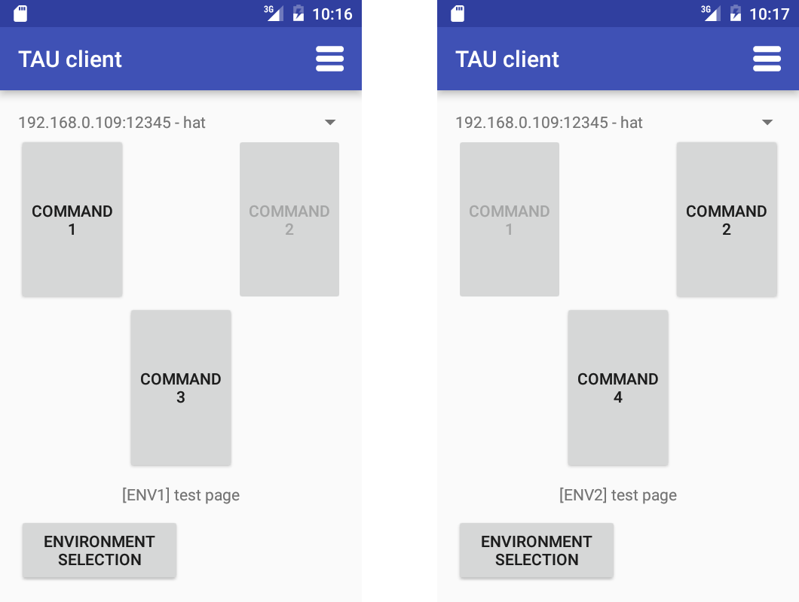
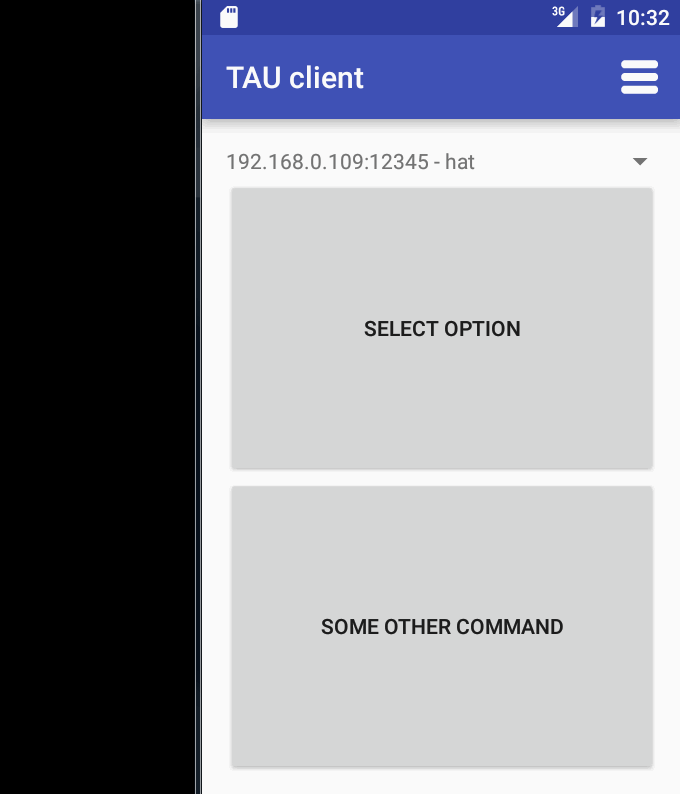

## Layout configuration file format ##

The layout configuration file holds the information about the positions and arrangement of the buttons for the commands on the user interface. This user interface is displayed on the client device, which is connected to the tool.

The layout consists of a set of pages one after another. Each time only one page is displayed to the user. The page contains several buttons for the commands.

### Layout page format ###

The layout page description always starts with a header line of a format `page:[page name]`. The page name could be any text without newlines, which describes this page's purpose.

After the header, a page body is added. The page body consists of one or several rows of command `id`s, which will be represented as buttons to the user on the client device's screen. Each line of text represents one row. Empty lines are not allowed. If you need an empty row, put a single `;` sign there.

The elements in the row are separated by a `;` sign. If no `id` is specified at some position, this position in the row with remain empty.
At each position there could be several command `id`s specified. It is done, so if the main command is not defined for some of the environments, another command could be placed at that spot.

Here is an example of a [one-page config file](../config_samples/layout_config_layout1.info):

```
page:test page
command1;;command2
;command3,command4;;
```

Let's assume, that we have a 2-environment configuration, where command3 is not defined for the second environment, and command4 is defined for it. Also, let's define command1 only for the first environment, and command2 only for the second one.
Here is the contents of the [commands config file](../config_samples/layout_config_commands1.csv) for this example (see the [commands config description](commands_config.md)):

|command_id|command_category|command_note|command_description|ENV1|ENV2|
|------|------|------|------|------|------|
|command1|test_hotkey|command 1|executes command 1|c1|
|command2|test_hotkey|command 2|executes command 2||c2|
|command3|test_hotkey|command 3|executes command 3|c3|
|command4|test_hotkey|command 4|executes command 4||c4|

Using these configuration files, here are the layouts presented to the user when the first and second environment is selected respectively:



Note the differences in the displayed buttons. If the command is not defined for the environment, it's button is disabled (see the buttons in the first row). If there is an alternative for the undefined command, it is picked up and placed in the layout instead (see the second row).

Also, note the buttons and text on the bottom of the page. These are the page description text and navigation buttons (if there are more than one page, the navigation buttons allow to switch between pages).

### Options selection pages ###

In some situations there are several similar variations of a command, which are all useful, but will overcrowd the layout page, if all are added there. For the situations like that there is a special type of pages - _options selection pages_.
In the configuration file, these pages are different only in the header format. Here is the header format for them: `optionsSelectorPage:[selectorID];[options selector page name]`. The `[selectorID]` is the identifier for this page. This identifier should not conflict with any of other `id`s in any of the configs.

Now, this identifier can be added to the normal page as one of the command `id`s. When the button for it is pressed, the options selector page is displayed. After any of the command buttons on that page is pressed (option is selected), the tool switches back to the original page.

Here is the demo of this functionality:



The configuration files listings for this demo are:

[commands config](../config_samples/layout_config_commands2.csv):

|command_id|command_category|command_note|command_description|ENV1|
|------|------|------|------|------|
|command1|test_hotkey|option 1|executes command 1|c1|
|command2|test_hotkey|option 2|executes command 2|c2|
|command3|test_hotkey|option 3|executes command 3|c3|
|otherCommand|test_hotkey|some other command|executes command 3|other|

[layout config](../config_samples/layout_config_layout2.info):
```
page:main page
optionsScreen
otherCommand
optionsSelectorPage:optionsScreen;select option
command1;
command2;
command3;
```

